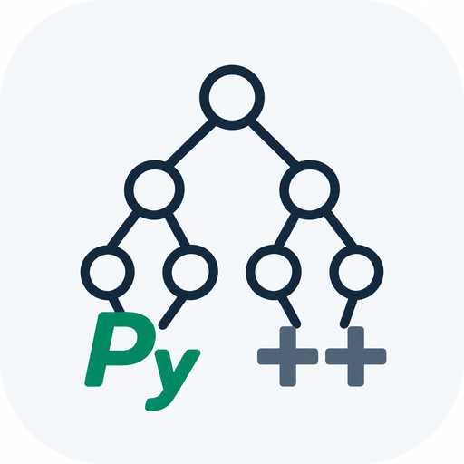

<p align="center">
  <a href="https://algorithm.ebook.ttzg.site/">
    
  </a>
</p>

<h1 align="center">算法笔记</h1>

<p align="center">
  <b>用 Python 打算法笔试与竞赛的完整教程。</b><br>
  从 <code>print("Hello")</code> 一路写到树链剖分，<!--N:chapters-->89<!--/N--> 章正文按顺序读就是一条完整的路；<br>
  配套 <!--N:problems-->366<!--/N--> 道真题，<b>每一份题解都在官方判题机上拿到过真实判定</b>。
</p>

<p align="center">
  <a href="https://github.com/w3903771/algorithm/actions/workflows/deploy.yml"></a>
  <a href="https://github.com/w3903771/algorithm/stargazers"></a>
  <a href="https://github.com/w3903771/algorithm/network/members"></a>
  <a href="#许可证"></a>
  <a href="LICENSE"></a>
</p>

<p align="center">
  <a href="https://algorithm.ebook.ttzg.site/"><b>📖 在线阅读</b></a> ·
  <a href="https://algorithm.ebook.ttzg.site/solutions/"><b>🧩 题解总览</b></a> ·
  <a href="#本地运行"><b>🚀 本地运行</b></a> ·
  <a href="#怎么改"><b>✍️ 参与改进</b></a>
</p>

---

## 这是什么

一本从零写到省选难度的 Python 算法教程，正文与题解都在站点上直接读。

- **[!--N:chapters--](!--N:chapters--)89 章正文，一条主线。** 语法 → 竞赛基本功 → 数据结构 → 算法 → 专题，
  每章开头写清前置依赖，不是知识点的堆叠。
- **[!--N:problems--](!--N:problems--)366 道真题，题解全部验证过。** 每道题都跑过官方样例，并在判题机上提交拿到真实判定；
  少数几道 CPython 常数过不去的，会写清为什么必须换 PyPy3。
- **正文里印出来的代码本身能跑。** 正文代码块被单独抽出来喂官方样例验证，跑不过的不许印在正文里。

## 目录一览

| 卷                       | 内容                                                                      | 章数                        |
| ------------------------ | ------------------------------------------------------------------------- | --------------------------- |
| **卷一 · 核心卷** | Python 语法、竞赛基本功、数据结构与基础算法。笔试面试要用的基本都在这一卷 | [!--N:vol1--](!--N:vol1--)53 |
| **卷二 · 提高卷** | 图论、动态规划、数学与字符串算法                                          | [!--N:vol2--](!--N:vol2--)29 |
| **卷三 · 竞赛卷** | 平衡树、树链剖分、CDQ 分治、整体二分这一类，省选难度                      | [!--N:vol3--](!--N:vol3--)7  |

完整章节盘见[站点首页](https://algorithm.ebook.ttzg.site/)，右侧数字是每章配了几道真题。

## 本地运行

需要 **Python 3.9+** 与 [uv](https://docs.astral.sh/uv/)。

```bash
git clone --depth=1 https://github.com/w3903771/algorithm.git
cd algorithm
uv sync
uv run mkdocs serve
```

浏览器打开 [http://127.0.0.1:8000](http://127.0.0.1:8000)。改动 `docs/` 下的文件会自动重建刷新。

只想拿静态站点：`uv run mkdocs build`，产物在 `site/`。

## 题目来源

题从哪来。**题数与验证情况见下一节**——这里只回答来源与判题方式。

四套题单登记在 [`data/_sources.json`](data/_sources.json)，新增或下线题单只改那一份，
索引、导航、进度表都会自动跟上。

| 来源 | 题单 | 题号段 | 判题模式 |
| --- | --- | --- | --- |
| [牛客在线编程](https://www.nowcoder.com/exam/oj?questionJobId=10&subTabName=online_coding_page) | 笔试模板必刷 | BISHI1–147 | ACM（读 stdin） |
| 同上 | 输入输出练习 | PIO1–18 | ACM（读 stdin） |
| 同上 | 面试必刷 TOP101 | BM1–101 | 核心代码 |
| [力扣热题 100](https://leetcode.cn/studyplan/top-100-liked/) | 热题 100 | LC ＋ 力扣真实题号 | 核心代码 |

后两套是**核心代码模式**——实现指定函数，不读 stdin。`scripts/verify.py` 按题单自动切判题方式：
ACM 题走 stdin 管道，核心代码题由 `scripts/corerun.py` 在子进程里按函数签名喂参、取返回值、比对结构
（`{3,2,1}` 与 `[3,2,1]` 判等）。

> 题面原文与抓取产物不入库（体量与版权），`data/_problems.json` 是它们的发布快照。
> 因此 `gen_index.py` 在 clone 的检出里跑不了——站点构建不需要它，读这份快照即可。

## 进度

| 目录 | 章数 | 正文 |
| --- | --- | --- |
| python | 16 | 16 / 16 |
| toolkit | 4 | 4 / 4 |
| math | 10 | 10 / 10 |
| ds | 15 | 15 / 15 |
| basic | 11 | 11 / 11 |
| search | 6 | 6 / 6 |
| string | 5 | 5 / 5 |
| graph | 11 | 11 / 11 |
| dp | 8 | 8 / 8 |
| geometry | 1 | 1 / 1 |
| technique | 2 | 2 / 2 |
| **合计** | **89** | **89 / 89** |

| 题单 | 题数 | 判题模式 | 已写题解 | 通过样例 |
| --- | --- | --- | --- | --- |
| 牛客 · 笔试模板必刷 | 147 | ACM（stdin） | 147 | 147 |
| 牛客 · 输入输出练习 | 18 | ACM（stdin） | 18 | 18 |
| 牛客 · 面试必刷TOP101 | 101 | 核心代码 | 101 | 101 |
| 力扣 · 热题 100 | 100 | 核心代码 | 100 | 100 |
| **合计** | **366** | — | **366** | **366** |

题解：**366 / 366 已写，366 题通过官方样例，366 题通过判题机实测（牛客 266＋力扣 100）**

> 其中 5 题（BISHI103 / BISHI128 / BISHI130 / BISHI138 / BISHI147）登记为 **PyPy3** 提交：
> 算法已是最优形态，纯粹是 CPython 的常数过不去。
> 提交语言登记在各题的 `meta.json`（`langs.py.submitLang`），理由写在各题解的文档字符串里。

## 怎么改

```
docs/            教程正文，一章一份 .md
  python/ toolkit/ ds/ basic/ search/ string/ math/ graph/ dp/ geometry/ technique/
  appendix/             附录：题单总索引、模板速查、避坑清单
solutions/       题解，按站点分层、一题一目录：<site>/<题号>/{sol.py, meta.json}
data/            站点构建要读的数据：题单登记、章节映射、题目元信息
scripts/         验证、生成与抓取脚本，见 scripts/README.md
hooks/           MkDocs 构建钩子：把 sol.py 渲染成站内题解页、注入章节盘与统计数
```

**改一段正文**　直接编辑 `docs/<主题>/<slug>.md`。章号不进路径，
阅读顺序由 `mkdocs.yml` 的 `nav` 决定——**重排顺序不会改任何 URL**。

**改一份题解**　编辑 `solutions/<site>/<题号>/sol.py`。
文件的文档字符串**就是**站内题解页的正文，改完跑一次自测：

```bash
uv run python scripts/verify.py BM45      # 只验这一道
uv run python scripts/verify.py           # 全部 366 道
```

**别手改这些**　`docs/appendix/a-problems.md`、`README.md` 的进度表、
各目录索引页的章数与题数——它们由 `scripts/gen_index.py` 生成，重跑即覆盖。
站点上的所有统计数字也一样，构建期注入，正文里只有占位符。

更多脚本与命令见 **[`scripts/README.md`](scripts/README.md)**。
其中抓取与判题机提交那几个需要登录会话与原始资料，clone 下来跑不了，那份文档里逐个写清了缺什么。

## 参与贡献

欢迎纠错与补充。最有价值的两类：**正文里的事实错误**，以及**题解跑不过的用例**。

1. Fork 本仓库，clone 到本地，切一个新分支；
2. 改动 `docs/` 或 `solutions/` 下的文件；
3. 本地跑一遍 `uv run mkdocs serve` 确认渲染正常；改了题解再跑 `uv run python scripts/verify.py <题号>`；
4. `git commit` → `git push` → 提 Pull Request，说清改了什么、为什么；
5. 只是发现问题、不想动手？直接开 [Issue](https://github.com/w3903771/algorithm/issues/new/choose)，写清哪一章哪一行。

细节见 [CONTRIBUTING.md](CONTRIBUTING.md)。提 PR 前请读一眼那里的**写作口径**——
正文有一套统一的文风约定，CI 会自动校验。

## 路线图

正文与题解已经成篇，接下来按下面的顺序推进。**每一项做完都会发布上线**，不攒大版本。

|                            | 计划                                                                                   | 状态   |
| -------------------------- | -------------------------------------------------------------------------------------- | ------ |
| **双轨代码**         | 每章正文同时给 Python 与 C++ 两份实现，页面上一键切换；补 C++ 语言基础与工具链共 14 章 | 进行中 |
| **模板库**           | 把散在正文里的模板抽成`templates/`，逐个加编译测试                                   | 计划中 |
| **洛谷题源**         | 接入洛谷判题链路，题目带上难度分级与算法标签                                           | 计划中 |
| **例题详略重排**     | 每章的例题分成「详解」与「速览」两档，例题表补上这一列                                 | 计划中 |
| **卷二 · 卷三扩写** | 卷二补 35 章、卷三补 87 章，覆盖到省选与金牌难度                                       | 计划中 |

已经完成的：89 章正文成篇 · 366 道题解全部通过判题机 · 正文代码块逐段验证 ·
全站链接与锚点零失效 · 站点统计数字全部构建期生成。

欢迎在 [Issues](https://github.com/w3903771/algorithm/issues) 里提想看的主题。

## Star 趋势

<!--
  GitHub 2026 年限制了 stargazer API，star-history 的公开图会渲染成一句
  「GitHub restricted access to star data」。下面这串 sealed_token 是
  star-history 发给仓库所有者的临时绕法，官方说明见
  star-history.com/blog/github-stargazer-api-restriction
  —— 它只用来读本仓库的公开 star 数，不是 GitHub 凭据，放在公开 README 里是预期用法。
  哪天官方恢复了公开接口，把 &sealed_token=… 去掉即可。
-->
<a href="https://www.star-history.com/?repos=w3903771%2Falgorithm&type=date&legend=top-left">
  <picture>
    <source media="(prefers-color-scheme: dark)" srcset="https://api.star-history.com/chart?repos=w3903771/algorithm&type=date&theme=dark&legend=top-left&sealed_token=kIjo94sWYk73n17EM8iC0UeiOi4Uoc0Uve6twCUOyQjUkEzFB1YdoFlgfbFiPCj7FEWPUESShXJh8I8qWygH1AL17cVqul1fehFiTbimsfSCicBzdV7zGj0UYkqTtaLYccm7hPrDK1pO218kqSWn6W9_nw9JODUz0H9ihb9vWyoXLuTcLQIxhZo0FKSH" />
    <source media="(prefers-color-scheme: light)" srcset="https://api.star-history.com/chart?repos=w3903771/algorithm&type=date&legend=top-left&sealed_token=kIjo94sWYk73n17EM8iC0UeiOi4Uoc0Uve6twCUOyQjUkEzFB1YdoFlgfbFiPCj7FEWPUESShXJh8I8qWygH1AL17cVqul1fehFiTbimsfSCicBzdV7zGj0UYkqTtaLYccm7hPrDK1pO218kqSWn6W9_nw9JODUz0H9ihb9vWyoXLuTcLQIxhZo0FKSH" />
    
  </picture>
</a>

## 贡献者

<a href="https://github.com/w3903771/algorithm/graphs/contributors">
  
</a>

## 支持项目

写完 [!--N:chapters--](!--N:chapters--)89 章正文和 [!--N:problems--](!--N:problems--)366 道题解花了不少时间，站点长期免费、无广告、无付费墙。
**点一个 Star 就是最好的支持。**

想再多做一点，可以请作者喝杯奶茶 🧋 —— 一杯 5 块，不设任何门槛，
教程的全部内容对所有人一视同仁。

<table>
<tr>
<td align="center" width="300">
  <a href="https://afdian.com/a/hassel"><b>爱发电</b></a><br>
  <sub>月度赞助，随时可取消</sub><br><br>
  <a href="https://afdian.com/a/hassel">
    
  </a>
</td>
<td align="center" width="300">
  <b>扫码请客</b><br>
  <sub>支付宝与微信通用</sub><br>
  
</td>
</tr>
</table>

## 许可证

**正文**（`docs/` 下的全部内容）采用
[知识共享 署名-非商业性使用-相同方式共享 4.0 国际（CC BY-NC-SA 4.0）](https://creativecommons.org/licenses/by-nc-sa/4.0/deed.zh)。
可以自由分享与改编，但须署名、不得用于商业目的、并以相同许可分享。

**代码**（`solutions/`、`scripts/`、`hooks/` 与构建配置）采用 [MIT](LICENSE)，随便用。

题面原文与题单元数据的版权归各判题平台所有，本项目只保存题号、标题与链接。
